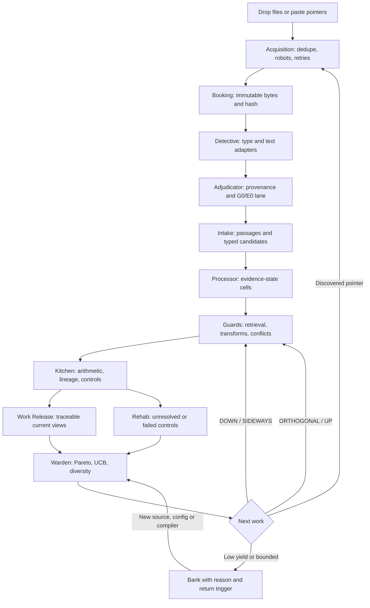

# ARIADNE: algorithm-only Warden pipeline

## Decision and scope

Use **a custody ledger plus deterministic compiler passes, hybrid retrieval, typed structural guards, assumption-labelled proposals, and a Pareto/UCB search scheduler**. Wrap it in one continuously running local Warden with a small browser interface. Neural models and agent runtimes are excluded from this build. There are no paid inference calls, API keys, database servers, or distributed services in the runtime.

This is the best fit for ARIADNE's present contract and resources, not a proof of universal algorithmic optimality. CPU time, disk, electricity and network access still have costs. Neither the supplied “98%/2%” split nor the quoted per-query costs were supported by measurements. They are not implementation assumptions.

The supplied material contains five substantial core-stack recommendations, a sixth frontier-stack recommendation in the attachment, and an orchestration/prison design. They are preserved separately below. The later feed/acquisition specification and continuous-operation/Neurite requirements are incorporated.

## The six recommendation families

| ID | Recommendation family | Best contribution | Limiting prerequisite / failure mode | Decision |
|---|---|---|---|---|
| R1 | Typed graph + hybrid retrieval + recursive motifs + multiobjective information value | A complete custody-to-next-search loop; structural matching across different wording/cardinality | Retrieval novelty is not epistemic novelty; unconstrained motifs create false alignments | **Selected backbone**. Keep distinct transforms, rank separately from support, challenge before any release |
| R2 | Enhanced retrieval + constrained graph paths + novelty/coverage controller | Cheap-to-expensive order, explicit directional query specifications, bounded graph work | BM25+ is not SQLite's built-in BM25; cited controller names do not supply a validated probability model | Use actual FTS5 BM25, typed indexed joins and bounded BFS. Larger RPQ/DAG algorithms remain extensions |
| R3 | Anti-unification + e-graphs + ATMS/provenance + MCTS/BALD + FSTs | Preserved alternative assumption environments and auditable abstract rule proposals | Exact semantics, rewrite rules, probability distributions and manageable state spaces are not yet available | Adopt first-order LGG, explicit AND support/alternative environments/conditional nogoods. Defer full e-graphs, ATMS closure and MCTS/BALD |
| R4 | Classical modular search/graph/discrepancy/recursive acquisition stack | Small interchangeable modules, source acquisition separated from analysis | A relevance-only controller can keep returning the same obvious evidence and neglect diagnostic outliers | Adopt module boundaries, local acquisition, explicit residuals; add protected torches and diverse scheduling |
| R5 | Symbolic core + bandits + optional neural residual layer | Cost-aware exploration and strict interface boundary for optional interpretation | No demonstrated fixed fraction of semantic exceptions; proposed neural confidence/cost claims are unverified | Adopt UCB allocation. Neural components are **excluded now**, not silently installed |
| R6 | Frontier stack: SAT, argumentation, topology, compilation, ILP, transport, causal invariance, sketches | Bounded formal inconsistency checks; multiscale recurrence; diverse portfolios; explicit prerequisite analysis | Most guarantees require mathematical inputs or statistical assumptions absent from a historical corpus | Implement bounded propositional deletion-minimal cores and exploratory multiscale signatures. Preserve every other family in the extension register |

### Probable outcomes by scenario (reasoned simulation, not package benchmarks)

| Scenario | R1/R2 | R3 | R4 | R5 with models disabled | R6 | Selected combination |
|---|---|---|---|---|---|---|
| Exact known words and many duplicate passages | Fast recall; fusion alone can still rank duplicates | Extra symbolic work buys little without formal structure | Strong simple baseline | Bandits can shift effort after repeated returns | Heavy compilation/topology is unjustified | Lexical/fuzzy retrieval first; type and duplicate checks before treating matches as connections |
| `72→70+2` versus `12→10+2` | Typed partition signatures can connect them | LGG proposes a shared term shape; it does not invent or prove historical meaning | Works if typed schemas are present | Same symbolic coverage as its core | ILP could generalize further given examples, negatives and metarules | Preserve both records; indexed residual-class join; LGG proposal; Kitchen leaves historical validation unresolved |
| `70+2`, `12×6`, and `36+36` all produce 72 | Safe only when operator identity is retained | Unrestricted numeric e-class merging would violate the contract | Count-only matching produces seductive false links | Neural suggestion does not resolve historical equivalence | Topological or compression similarity also cannot establish it | Keep operators separate; numerical address enables ORTHOGONAL search, never an identity merge |
| Two derivatives repeat one witness | Raw frequency can falsely resemble corroboration | Provenance can represent dependence if supplied | Centrality alone can amplify copied claims | Learned weights need dependence modelling | Truth-discovery/model-counting can also amplify dependence | Declared shared family fails independence; unknown family remains unknown |
| Very rare but high-value Judah clue | Novelty-only banking is insufficient | Disagreement may help only with correctly modelled hypotheses | Greedy relevance can miss it | Exploration helps but is not a retention guarantee | DPP/argumentation may help if their inputs are appropriate | Protected torch remains visible and gets allocation before unprotected work; banked never means deleted |
| Unknown script, metaphor, unexpressed causal structure | Cannot reliably decode from these schemas | Formal machinery cannot manufacture missing semantics | Same limitation | Disabled models add no semantic capacity | ILP/ICP/sheaves do not remove absent assumptions | Preserve raw text and extraction gaps; create leads without invented linguistic or historical conclusions |
| Crash, restart, changed parser, new source | Requires persistence outside ranking | Formal worlds alone are not a recovery mechanism | Modular storage helps | Model choice is irrelevant to recovery | Compiled knowledge also needs versioned inputs | Transactional state changes, row-version history, code/config capture, checksummed snapshots, automatic reopening |

The selected system combines the compatible contributions. It does not equate “more algorithms” with “more power.” One full MCTS/e-graph/knowledge-compilation system would require additional models, dependencies and experiments before it could replace this controller.

## Prison flow and exact algorithm placement

Custody, event history and row versions underlie every stage; they are not a late logging add-on. “Spring” is the current view/report/export, not a truth certification or automatic public deployment. “The Hole” contains unresolved/extraction residuals. The experimental algorithm area contains LGG and multiscale proposals. Cell names classify evidence state; they are not value judgments about sources.

| Stage | Implemented algorithms / mechanism | Persistent output | Gate / important unknown |
|---|---|---|---|
| Acquisition | URL/DOI/arXiv parsing, normalized-pointer deduplication, finite redirects, public-IP validation, robots checks, retry backoff, depth-bounded link expansion | Jobs, pointer relationships, raw manifests, retrieved metadata, exact source bytes | Failed fetch is never “no evidence”; auth/paywall/robots states remain visible |
| Booking | SHA-256, immutable custody copy, exact duplicate detection | Original source row, custody file, ingest event | Verify copied bytes before extraction |
| Detective | Existing text/CSV/HTML adapters; optional installed Poppler `pdftotext`; explicit gaps for unreadable inputs | Extracted passage text and extracted-text/JSON locators | OCR, unfamiliar formats and unknown languages are not silently inferred |
| Adjudicator | Deterministic chat recognition; declared witness/family/language metadata | G0 guidance or E0 candidate lane; unknown fields | Metadata is declared, not independently verified |
| Intake | Numeric partition/factor and explicit arrow/variant patterns; typed JSON records | Separate carriers, decoder fields, residual counts/status/functions and source-located candidates | Machine extraction never becomes source-explicit truth |
| Processor | Deterministic evidence-state assignment | AD_SEG / COLD_CASE / GEN_POP candidates | No algorithm graduates evidence to E1/E2 in this release |
| Retrieval guards | FTS5 BM25; Aho–Corasick torch terms; NFC/case normalization; explicit aliases; trigram postings; restricted Damerau/OSA; TF-IDF/cosine; RRF | Query/result evidence, channel attribution, visible bounds | Alias expansion does not merge identities; BM25 is not BM25+ |
| Structure guards | Indexed typed-signature joins, type-constrained address lookup, bounded BFS, first-order anti-unification | Proposed connections, experimental generalized terms, graph edges | Shared LGG does not prove `N-k` semantics; input partition arithmetic supplies only the numeric check |
| Discrepancy guard | Compare declared subject/predicate/scope; retain each reading; conditional exclusive-predicate nogood | Alternative environments plus explicit premises | Multivalued predicates create variants, not contradictions; exclusivity is an assumption |
| Formal guard | Exhaustive propositional satisfiability with deletion-based minimal unsat-core extraction | Original clauses and core indices in ledger | Explicit user-supplied clauses only; default at most 12 variables/64 clauses; minimal is not minimum |
| Kitchen | Arithmetic validity, declared lineage comparison, passage trigram duplication, two-premise leave-one-out fragility | Checks and FAILED_CONTROL/UNRESOLVED verdict | Null model, translation, historical plausibility and labelled negative controls remain UNKNOWN unless supplied; absent tests never pass |
| Navigation | DOWN/SIDEWAYS/ORTHOGONAL/UP query records; query-context deduplication; all origins/return paths retained | Branches, result observations, parent links, query runs | Runs local searches and acquired-pointer expansion; not a paid general web-search service |
| Allocation | Pareto layers; configurable utility weights; per-direction UCB; greedy directional diversity; explicit protected torches | Scores/reasons, config versions, branch metrics | UCB score is a heuristic here; adaptive nonstationary research does not inherit textbook regret guarantees |
| Banking | Unique returns, duplicate ratio, singleton fraction, stale rounds, revision/limit/depth triggers | Banked/protected/deferred state with reason | Good–Turing singleton fraction is descriptive under adaptive retrieval, not a global completion certificate |
| Fractal guard | Literal, proportional and operator abstraction; two WL neighborhood refinements | Versioned multiscale memberships and return anchors | Recurrence is neither a statistical significance certificate nor proof that the corpus is fractal |
| Release / view | Current-version queries, escaped offline HTML, complete JSON, Neurite Zettelkasten export | Current report; historical extractions retained separately | K shown is explicit; N remains stored and available |

### Why this order

1. **Custody before every inference:** improved parsers must be able to return to the original. A graph or summary is not an adequate replacement.
2. **Guidance/evidence separation before matching:** otherwise the user's research discussion can become circular corroboration for its own hypotheses.
3. **Type extraction before structural alignment:** equal numbers are addresses for exploration; operation, residual role, decoder and scope remain separate.
4. **Cheap indexed retrieval before expensive comparisons:** FTS and trigram postings reduce the local candidate set. Explicit caps are reported, not mistaken for completeness.
5. **Provenance and lineage before support interpretation:** ten copies cannot silently become ten independent witnesses.
6. **Challenge before released interpretation:** a connection can be displayed as unresolved without having passed controls. Machine connections remain proposals.
7. **Novelty measurement after actual returns:** rewarding query creation or duplicate findings would create a self-amplifying loop.
8. **Portfolio allocation after retention:** protection and diversity govern attention, not storage. Low-ranked branches stay represented.
9. **Bank after a recorded stopping reason:** changed evidence/config/implementation reopens the local problem. It does not require the operator to remember where it stopped.
10. **Version every mutation, not just final reports:** an operator can inspect how a belief, queue state or source status changed between snapshots.

## Selected kernel and remaining algorithm families

“Implemented” below means executable code; “extension” means deliberately retained design territory, not a hidden capability claim.

| Family / algorithms | Disposition | Condition for introduction |
|---|---|---|
| FTS5 BM25, Aho–Corasick, trigrams, OSA, TF-IDF, RRF | Implemented | Existing hot path |
| Deterministic alias/transliteration tables | Implemented retrieval alias configuration | Only supplied mappings; no invented morphology |
| MinHash | Implemented reusable signature utility; not yet used as an indexed LSH layer | Corpus-scale duplicate candidate pressure; measure recall against exact comparisons |
| SimHash, LSH, FM-index/CSA, FST/DAWG/Levenshtein automata | Extensions | Measured memory/substring/fuzzy-search bottleneck; no constant-time promise |
| Typed motifs, structural templates, bounded BFS | Implemented | Explicit source-located structure |
| gSpan, VF2, g-tries, FANMOD/color-coding, PrefixSpan/GSP, full RPQs/DAG matching | Extensions | Typed graph dataset, motif-size budgets, negative controls and benchmark proving value |
| PageRank, betweenness, Leiden/Louvain | Extensions | Citation/lineage graph sufficiently typed; influence must remain separate from credibility |
| First-order LGG | Implemented experimental rule proposals | Shared syntactic structure only |
| Equality saturation, differential Datalog | Extensions | Sound explicitly typed rewrite/logic rules, incremental workload and memory limits |
| ATMS / provenance semirings | Partial practical mechanisms implemented | Full ATMS label closure, complete semiring algebra, retraction propagation and formal semantics remain future work |
| Bounded minimal unsat core | Implemented separate formal-input command | User-supplied propositional clauses |
| Full MaxSAT, correction-set enumeration, exact backbone, Dung extensions, DEL model checking | Extensions | A justified finite logical encoding; complete alternative enumeration may be exponential |
| Pareto, UCB, directional diversity, protected archive | Implemented | These do not delete dominated candidates |
| DPP, MAP-Elites, Thompson sampling, full MCTS | Extensions | A useful kernel/niche model/posterior/rollout transition model and comparative evidence |
| Expected information gain / BALD | Extension, not claimed by current scores | Explicit hypotheses, prior/posterior and likelihood of possible observations |
| Good–Turing singleton fraction, duplicate rate, observed novelty | Implemented, descriptive | No open-world coverage denominator invented |
| Capture–recapture, Chao/Chao–Shen, formal missing-mass intervals | Extensions | Sampling design and dependence assumptions recorded and checked |
| Isolation forest, LOF, kNN novelty | Extensions | A justified feature space and outlier interpretation; outliers are not automatically semantic exceptions |
| Hodge decomposition, sheaf Laplacian | Extensions | Defined flow/complex/restriction maps; topology does not intrinsically encode historical contradiction |
| Persistent homology | Extension | A justified filtration, controls and statistical interpretation; long bars are not automatic significance |
| d-DNNF/SDD weighted model counting | Extension | Encoded worlds and explicit weights/prior assumptions; compilation cost and size measured |
| ILP/meta-interpretive learning | Extension | Positive/negative examples, metarules, search language and declared minimality criterion |
| Gromov–Wasserstein alignment | Extension | Metric-measure graphs and controls; transport distortion is not historical dependence |
| Invariant causal prediction | Extension | Causal variables/environments and model assumptions; cross-tradition invariance alone is not causality |
| MDL/NCD | Extension | Declared coding model and compression controls; compression is not a truth oracle |
| Hyperdimensional/VSA representations | Extension | Binding/unbinding accuracy and collision tests; vectors are still a lossy representation |
| TruthFinder/CRH/Sums, Snorkel-style label models | Extensions | Source/detector dependence, identifiability and calibration tests; agreement alone is insufficient |
| RG-inspired coarse views | Implemented only as explicit multiscale membership/navigation | No claim of physical RG fixed points or fractal dimension |
| Partial information decomposition | Extension | Joint distribution, target and redundancy definition |
| HyperLogLog, Count-Min, t-digest | Extensions | Measured streaming-memory pressure; error bounds visible in views |
| Embeddings, GNN, LLM, agents | Excluded from current runtime | Would require a later user decision and measured need |

## Continuous operation and epistemic versioning

`python warden.py serve` runs the local interface and an algorithm worker. `watch` provides a headless alternative. The worker waits when idle, resumes pending branches in finite batches, fetches queued pointers, records failures with retry backoff, and revisits retained branches after corpus/config/compiler changes. It does not run duplicate local queries merely to look busy.

The server listens only on loopback. Input requests use a per-process token and Host checks. Acquired sources cannot execute code. Downloads validate public destinations (including redirects), pin the validated IP for the connection, respect the current robots adapter, and use time/size/depth bounds. These controls implement the acquisition boundary; they do not require an agent or paid service.

Every managed ordinary SQLite table has automatic INSERT/UPDATE/DELETE row-history triggers. Initial v0 rows receive a baseline. Immutable history rows include before/after records and a hash-chain link. FTS shadow tables are rebuildable indexes over versioned passages. Code contents are captured under an implementation ID; configuration and processing events are retained. Current findings are selected against each source's compiled implementation; superseded versions remain available, without contaminating current proposals.

Each completed processing cycle makes an online SQLite backup with its state revision, checksum and schema manifest. `history --at N` reconstructs logical rows at a chosen row transition. `recover` creates a new database and refuses to overwrite an existing one. The original custody directory must accompany the database backup; source bytes are not embedded inside SQLite. **Snapshots alone are not a complete source backup.**

Hash chains detect accidental alteration and inconsistent replay. They are not externally signed tamperproof records against an attacker who can replace both history and backups. The tests establish specific invariants, not a promise of “flawless” epistemic judgment.

Continuous operation requires the machine/process to be running. Startup templates are included; they have not been installed on the operator's machine. Sleep/power loss pauses work, then restart resumes persisted state. Full snapshots and permanent custody grow with the corpus; no automatic destructive retention policy is imposed. Archive storage and tested backup copies are required as volume grows.

## Neurite investigation and adaptation

Inspected upstream Neurite commit `e62b270402b688a39a864007b9c0a02711b9573e`.

| Inspected mechanism | ARIADNE adaptation | What is not inferred |
|---|---|---|
| `ZetPath.Branching` / radial paths: parent indices, recursive depth and relative scales | Exact evidence anchors plus parent branch/scale links; multiscale recurrence memberships | A branching display does not validate its nodes |
| `NodePlacementStrategy`: relative position and scale from a parent | Navigation retains the parent/return address when moving between scales | No unsupported geographic or historical proximity inference |
| `saveCurrentView` / `returnToSavedView`: saved scale and coordinates | Persistent branch context and versioned return paths; Neurite-compatible note export | Current report is not an interactive Mandelbrot renderer |
| `findPeriod`, bounded orbit iteration, boundary sampling | Inspiration for bounded recurrence and revisiting unstable/unresolved regions | ARIADNE does not apply Mandelbrot period formulas to historical assertions |

The executable fractal guard builds three abstraction scales for partitions: exact counts; reduced proportions; operator family. It also compares two rounds of typed graph-neighborhood signatures. All members are retained. The result is a **candidate self-similarity map** with exact provenance, not a fractal-dimension estimate or discovery of causal transmission. Coarse grouping can hide differences, so every coarse view links to the underlying operators and sources.

## Validation and actual limitations

See [SIMULATION.md](validation/SIMULATION.md) for the reproducible 12-seed/20-source component experiment and [VALIDATION.md](validation/VALIDATION.md) for commands and checks. Type/arithmetic guards improved comparison precision in the partition fixture; richer retrieval alone did not. The simulation does not establish which advanced unimplemented research framework is fastest or most accurate.

Still limited: extraction covers explicit patterns and typed records; metadata/lineage are mostly unknown or declared; controls requiring historical/linguistic judgment remain unresolved; a DOI may yield only a landing page; GitHub acquisition currently queues metadata/README/tree pointers, not an operational repository build; links are discovered pointers, not automatically established citations; no OCR, authenticated-site access, ISBN resolver, browser extension, full E1/E2 review UI, or autonomous connection from this ChatGPT session to localhost is included. The 20-message receiver is implemented for a sender that connects to it.

The next scaling risks are quadratic motif pairing/Pareto sorting, whole-pass rescans, full SQLite snapshots, and the size of permanent source/history storage. Query, retrieval, acquisition, solver and depth bounds exist; a billion-token scalability claim would be unjustified. These are explicit extension triggers, not reasons to discard research threads.

## Primary references

- [SQLite FTS5 documentation](https://www.sqlite.org/fts5.html): actual MATCH/BM25 behavior and indexing features.
- [egg project](https://egraphs-good.github.io/): equality-saturation scope; compact representation does not mean constant memory.
- [McAllester and Schapire, Good–Turing convergence](https://www.schapire.net/papers/good-turing.pdf): missing mass and independent-sample assumptions.
- [Darwiche and Marquis, A Knowledge Compilation Map](https://arxiv.org/abs/1106.1819): representational succinctness and supported operations; efficient queries do not imply free compilation.
- [Neurite branching paths](https://github.com/satellitecomponent/Neurite/blob/e62b270402b688a39a864007b9c0a02711b9573e/js/zettelkasten/zetpath.js), [placement strategy](https://github.com/satellitecomponent/Neurite/blob/e62b270402b688a39a864007b9c0a02711b9573e/js/zettelkasten/zetplacementstrategy.js), [saved views](https://github.com/satellitecomponent/Neurite/blob/e62b270402b688a39a864007b9c0a02711b9573e/js/interface/dropdown/customui/displaysavedcoords.js), [fractal routines](https://github.com/satellitecomponent/Neurite/blob/e62b270402b688a39a864007b9c0a02711b9573e/js/mandelbrot/mandelbrot.js): inspected implementation, with adaptation limits above.
